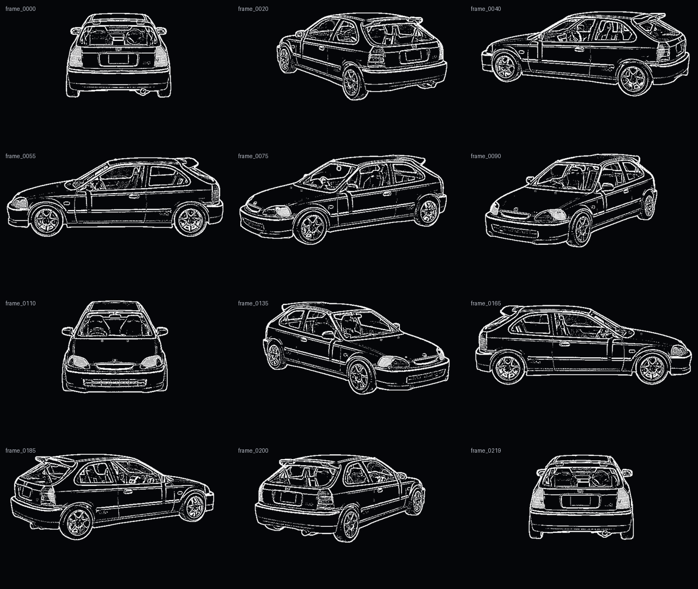

# Cyberdash Red — Raspberry Pi Civic Dashboard

This is the fresh Kivy dashboard package for the Raspberry Pi 5. Its structured
red/white telemetry layout adapts to 640×480, 800×480 and widescreen displays
without stretching the Civic. It includes the approved rotating Honda Civic
artwork directly in the repository, so the Pi does not need to convert or copy
any car frames.

## Approved telemetry layout

- clipped-corner four-panel frame with restrained red racing accents
- large time and date module with a technical divider
- inside/outside climate rows with anti-aliased white/red thermometer icons and
  red segmented gauges
- rotating Civic module labelled `HONDA CIVIC EG9 // B16A2` with `360 LIVE`
- sound-triggered segmented visualizer using GPIO22, with a safe simulated
  fallback when the microphone module is not connected
- solid red baseline segments that progress through coral and pale red to
  white at full height
- no continuous gray climate tracks and no diagonal background clutter

## Approved Civic animation

- 220 transparent PNG frames in preserved rotation order
- sharp white outline/etch artwork with windows, wheels, grille and body detail
- headlights and taillights filled at 70% white opacity
- lamp fills constrained to real housing pixels in every source angle
- smooth early fade-in and late fade-out around the visible lamp angles
- one complete rotation every 12 seconds
- one shared crop for all frames, preventing vertical or sideways movement
- clean no-red frames loaded from `assets/civic_frames_outline`
- four soft Kivy floor-frame edges projected behind the Civic
- no red strip, red body lines or separate animation timer
- the floor frame rotates through the exact same angle as the Civic



The full motion preview is available here:
[approved 12-second rotation](preview/approved_civic_rotation_12s.mp4).

## Files to run

- `civic_360_test.py` — tests only the approved Civic animation
- `dashboard_v2.py` — runs the responsive fullscreen dashboard
- `startup_loader.py` — fades and pulses the SiR emblem while V2 loads
- `assets/startup/sir_loader_logo.png` — transparent 520×96 loader emblem
- `sensor_test.py` — tests both BME280 sensors in the terminal
- `civic_360_widget.py` — reusable player used by both Kivy programs
- `start_dashboard.sh` — launches V2 without opening a Terminal window
- `install_autostart.sh` — enables launch after the Pi desktop starts
- `install_kiosk_startup.sh` — starts only Cyberdash in the labwc session
- `disable_kiosk_startup.sh` — safely restores the previous desktop startup
- `dashboard_v1_handoff_reconstructed.py` — preserved reconstructed V1 baseline
- `build_approved_civic_frames.py` — optional frame rebuilding tool
- `floor_glow.py` — projects the rotating soft red floor frame in code
- `sound_input.py` — reads the microphone module's digital sound trigger

`dashboard_v2.py` reads the inside BME280 at `0x77` and the outside BME280 at
`0x76`. Sensor connection errors are shown on screen without stopping the
dashboard. The audio visualizer uses the four-pin sound module when its digital
output is available and falls back to the original animation elsewhere.

## SiR startup loader

The dashboard and Civic textures begin loading behind a completely black
startup overlay. The SiR emblem fades in, grows gently into position, and
uses a restrained red breathing pulse until Civic rotation is ready. It then
fades away to reveal the already-running dashboard, so there is no second
window, white frame, or desktop flash between the loader and V2.

The loader stays visible for at least `3.0` seconds. It normally closes as
soon as all 220 Civic frames are decoded; a `12`-second safety limit prevents
a damaged frame set from trapping the display on the emblem. These values,
along with the fade and pulse speeds, are grouped at the top of
`startup_loader.py`.

## Install safely on the Raspberry Pi

These commands preserve the current dashboard as a timestamped backup, then
install this version in a fresh `~/Desktop/cyberdash_red` folder.

```bash
cd ~/Desktop

backup_stamp=$(date +%Y%m%d_%H%M%S)

if [ -d cyberdash_red ]; then
    mv cyberdash_red "cyberdash_red_backup_${backup_stamp}"
fi

git clone \
    https://github.com/hufi94/cyberdash-red.git \
    cyberdash_red

cd ~/Desktop/cyberdash_red
python3 -m venv .venv --system-site-packages
source .venv/bin/activate
python -m pip install --upgrade pip
python -m pip install -r requirements.txt
```

## Preview the Civic first

```bash
cd ~/Desktop/cyberdash_red
source .venv/bin/activate
python civic_360_test.py
```

Press **Esc** to close the preview.

## Run the full dashboard

```bash
cd ~/Desktop/cyberdash_red
source .venv/bin/activate
python dashboard_v2.py
```

Press **Esc** to close it. V2 starts fullscreen by default. It keeps the layout
480 design pixels tall and adapts its width to the detected screen:

- 640×480 uses the compact four-panel layout.
- 800×480 uses the full wide panel instead of leaving 80-pixel side bars.
- 16:9 monitors use an 853×480 layout before uniform scaling.

A three-pixel screen inset keeps the accents clear of the physical display
edge while using more of the 3.5-inch panel. At 640×480, the interface applies
a sixteen-percent typography boost plus a twenty-four-percent boost for the
clock and temperature numbers, tighter seven-pixel panel margins, and larger
Civic and visualizer viewports. Wider HDMI displays keep the original spacing
and typography scale.

To test it in a normal resizable window instead, run:

```bash
CYBERDASH_WINDOWED=1 python dashboard_v2.py
```

## Audio visualizer modes

The dashboard currently starts with the smooth simulated visualizer. No
microphone wiring is required, and the visualizer header displays
`SIMULATED INPUT`.

When the new USB microphone is available, this input layer will be replaced by
real USB audio capture without changing the dashboard layout.

## Test the existing four-pin sound module

This first test uses the module's `DO` digital output. It makes the visualizer
respond to real sound and beat threshold crossings, but it does not provide
separate bass, mid and treble frequency measurements. Those require a future
USB audio input or ADC.

Connect only these three wires while the Pi is powered off:

| Sound module | Raspberry Pi 5 |
| --- | --- |
| `+` | 3.3 V, physical pin 17 |
| `G` | Ground, physical pin 20 |
| `DO` | GPIO22, physical pin 15 |
| `AO` | Leave disconnected |

Use **3.3 V only** for this test. Do not connect the module's `+` pin to 5 V
while `DO` is attached directly to the Raspberry Pi.

After powering on, turn the module's blue sensitivity adjustment slowly until
its digital-output indicator is off during silence and flashes with nearby
music. The GPIO mode is optional and must now be selected explicitly:

```bash
cd ~/Desktop/cyberdash_red
source .venv/bin/activate
CYBERDASH_SOUND_INPUT=gpio python dashboard_v2.py
```

The visualizer header displays `SOUND // LIVE` when GPIO22 is active. If the
GPIO library is unavailable, it displays `SIMULATED INPUT` and keeps running.
The normal command uses the simulated visualizer:

```bash
python dashboard_v2.py
```

## Start automatically with the Raspberry Pi

Only enable this after the fullscreen dashboard has been checked manually:

```bash
cd ~/Desktop/cyberdash_red
chmod +x start_dashboard.sh install_autostart.sh disable_autostart.sh
./install_autostart.sh
```

The installer creates a desktop autostart entry with `Terminal=false`, so no
Terminal window appears during normal startup. It preserves an existing
Cyberdash Red entry before replacing it and reports possible older dashboard
entries without changing them.

Reboot to test:

```bash
sudo reboot
```

To disable this autostart safely later:

```bash
cd ~/Desktop/cyberdash_red
./disable_autostart.sh
```

The disabled entry is renamed with a timestamp instead of being deleted.

## Early startup without showing the desktop

On the tested Raspberry Pi LXDE setup, replacing the complete session autostart
caused Kivy to be terminated and restarted repeatedly. The recommended startup
therefore keeps the normal graphical session and uses a system service based on
the earlier proven Civic launcher. It waits for X11, paints the root window
black, and starts V2 directly. The SiR overlay is part of V2; no separate loader
process is launched.

First restore the normal desktop if stripped kiosk mode was previously enabled,
then install the reversible early-start service:

```bash
cd ~/Desktop/cyberdash_red
./disable_kiosk_startup.sh
chmod +x configure_displays.sh start_dashboard_early.sh install_early_startup.sh disable_early_startup.sh
./install_early_startup.sh
```

The early launcher applies the tested two-monitor profile before Kivy opens:

- the first Raspberry Pi micro-HDMI port (board `HDMI0`) is the primary
  640×480 dashboard display, rotated to **Inverted** (180 degrees);
- the second micro-HDMI port (board `HDMI1`) is the upright 1920×1080 work
  display, positioned to the right;
- if the work display is disconnected, the small dashboard display continues
  to use the same resolution and orientation on its own.

The defaults can be overridden without changing the script by setting
`CYBERDASH_SMALL_OUTPUT`, `CYBERDASH_WORK_OUTPUT`,
`CYBERDASH_SMALL_MODE`, or `CYBERDASH_WORK_MODE`. If 1920×1080 is unavailable,
the work display falls back to its preferred native resolution. Display-profile
errors are recorded in `runtime/dashboard.log` but never prevent the dashboard
from starting.

Keep **Boot to Desktop**, **Desktop Auto Login**, and the Raspberry Pi splash
enabled, then reboot:

```bash
sudo reboot
```

To disable early startup and restore the saved desktop-autostart entry:

```bash
cd ~/Desktop/cyberdash_red
./disable_early_startup.sh
sudo reboot
```

## Test the two BME280 sensors

```bash
cd ~/Desktop/cyberdash_red
source .venv/bin/activate
i2cdetect -y 1
python sensor_test.py
```

The I²C scan should show both `76` and `77`. Stop the terminal sensor test with
**Ctrl+C**.

## Civic player settings

The default rotation speed is defined near the top of `civic_360_widget.py`:

```python
ROTATION_SECONDS = 12.0
FADE_IN_SECONDS = 1.5
GLOW_OPACITY = 1.0
GLOW_FADE_EXTENSION_SECONDS = 1.0
```

A larger number rotates more slowly. The player uses elapsed time rather than
blindly advancing one frame per timer event, so temporary Pi workload cannot
permanently speed up or slow down the rotation.

The Civic remains completely hidden while its 220 frames load. Once the full
set is ready, rotation begins immediately while the vehicle fades in over
`FADE_IN_SECONDS`. Increase that value for a slower reveal, or set it to `0`
to show the rotating Civic immediately.

The dashboard loads the clean `assets/civic_frames_outline` sequence. Kivy
creates four soft red edge textures in memory and projects them as the two
sides, front and rear of a ground-plane rectangle beneath the car. At side
views the long side edge is emphasized. At front/rear views the appropriate
short edge is emphasized. At 45 degrees those edges form a slanted projected
frame instead of a horizontal bar. The player changes the Civic PNG and floor
projection together in the same `update_rotation` call, so there is no second
timer or independent motion. The glow is hidden during loading and fades in
at exactly the same time as the Civic.

Each projected side of the glow begins fading in one second earlier and
finishes fading out one second later. The overlapping light is drawn behind
the transparent Civic frames, so the longer fade remains beneath the car
instead of shining over its body. Change `GLOW_FADE_EXTENSION_SECONDS` to tune
that overlap without altering rotation speed or floor geometry.

The default effect is deliberately large and bright: its projected strip is
`52` source pixels wide, its center alpha is `250`, and its broad falloff is
`1.55`. For quick tuning, lower `GLOW_OPACITY` for less brightness. Adjust
`EDGE_GLOW_THICKNESS`, `GLOW_MAXIMUM_ALPHA`, or `GLOW_FALLOFF_POWER` in
`floor_glow.py` to change its spread, center intensity, or bloom softness.
Set `GLOW_ENABLED = False` to turn it off without changing any PNG frame.

## Optional: rebuild the transparent frames

The approved frames are already included. Rebuilding is only necessary if the
source renders change. Keep the original silver frames outside the output
folder, then run:

```bash
python build_approved_civic_frames.py \
    --source /path/to/original/silver_frames \
    --output /path/to/new/transparent_frames \
    --preview /path/to/preview.png \
    --line-thickness 1 \
    --edge-threshold 18 \
    --crop-padding 16
```

Appearance controls:

| Setting | Effect |
| --- | --- |
| `--line-thickness 1` | Approved thin, sharp technical lines |
| `--line-thickness 2` | Stronger lines for a brighter small display |
| Lower `--edge-threshold` | More windows, grille and surface detail |
| Higher `--edge-threshold` | Simpler artwork with less fine detail |
| `--crop-padding 16` | Shared transparent margin without frame-to-frame movement |

The approved settings are line thickness `1`, edge threshold `18`, crop padding
`16`, and no red underglow. The builder requires the complete ordered set of
220 source frames and writes `frame_order.txt` plus `lamp_tracking.tsv` for
verification. Headlight and taillight fills are extracted from real lamp
material in each source frame, then baked into that same transparent PNG. Kivy
does not animate a second lamp layer, so the fills cannot move independently
of the Civic.

## Development checks

```bash
python -m unittest discover -s tests -v
python -m py_compile \
    build_approved_civic_frames.py \
    floor_glow.py \
    civic_360_widget.py \
    civic_360_test.py \
    dashboard_theme.py \
    dashboard_v2.py \
    sensor_test.py
```

The source silver frames are not committed. The approved no-red set is
committed, and the glow is generated by Kivy, so a fresh Pi clone is complete.
